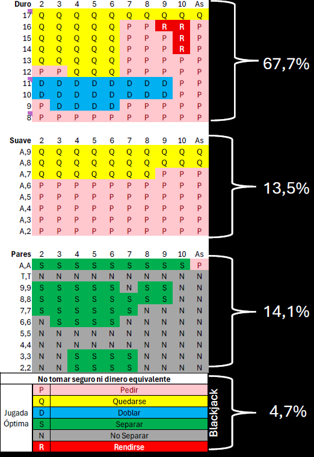
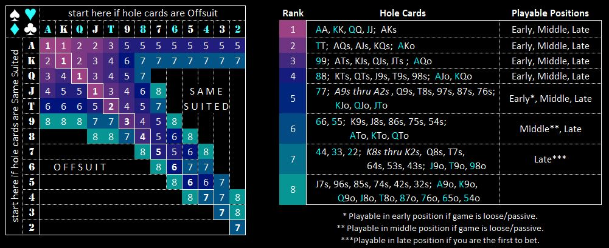

# Blackjack

- [Curso 21 Blackjack - Chile](archivos/Blackjack/Curso_21_Blackjack-Chile.pdf)
- [Demostración Jugada Óptima](archivos/Blackjack/Demostración Juego Óptimo_v4.xlsx)

“Blackjack is very scientific. There’s always a right answer and a wrong answer.” 
Charlie Ergen

{width=30%}

# Póker

“It’s not about the cards you’re dealt, but how you play the hand.” 
Randy Pausch

{width=90%}

