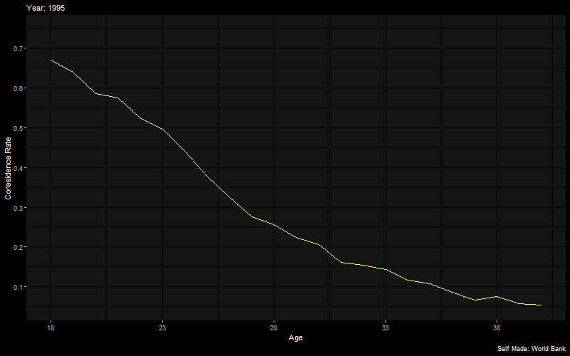
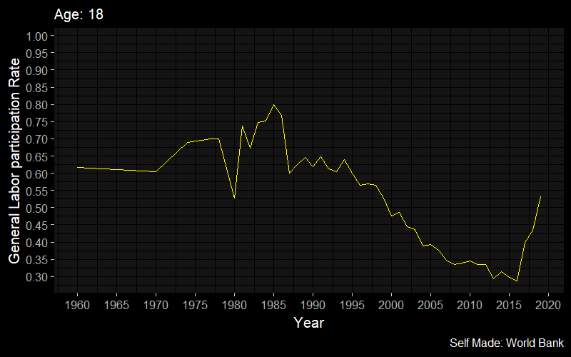
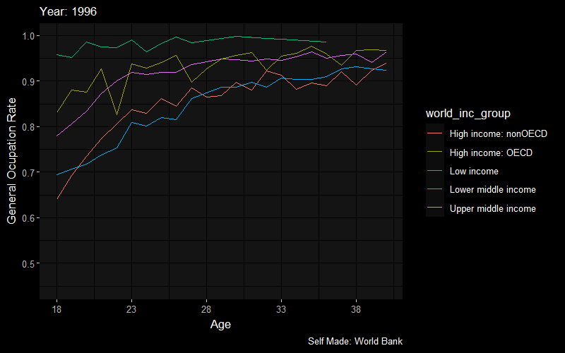

# Social Movility Around the World (in progress). Working with [Claudio Montenegro](https://econ.uchile.cl/es/academico/cmontene) & [Javier Nuñez](https://econ.uchile.cl/es/academico/jnunez)

$$\text{Coresidence Rate}=\frac{\text{Children living with their parents}}{\text{Total of Children}}$$

{width=60%}
{width=70%}

{width=70%}

$$\text{Labor Force Participation Rate}=\frac{Employed + Unemployed}{\text{Working age population}}$$

{width=60%}

{width=70%}

$$\text{Ocupation Rate}=\frac{Employed}{\text{Working age population}}$$

{width=60%}

{width=70%}

### Intergenerational Elasticity 
$$y_s=\text{ln(Children's income) or Children's Education}$$
$$y_f=\text{ln(Father's income) or  Father's Education}$$
$$X=\text{Control Variables}$$

$$y_s=\beta_0+\underbrace{\beta_1}_{\text{Intergenerational Elasticity}} y_f+\beta_2X+u_i$$
The closer the beta is to 0, the greater the social mobility.

{width=60%}

{width=60%}
