# Intergenerational Mobility Around the World (in progress). Working with [Javier Nuñez](https://econ.uchile.cl/es/academico/jnunez) & [Claudio Montenegro](https://econ.uchile.cl/es/academico/cmontene) 

- [Presentación 1](archivos/Tesis/Tesis_Presentacion_1.pdf)
- [Draft - Working Paper](archivos/Tesis/Tesis_working_paper_MOVILIDAD.pdf)

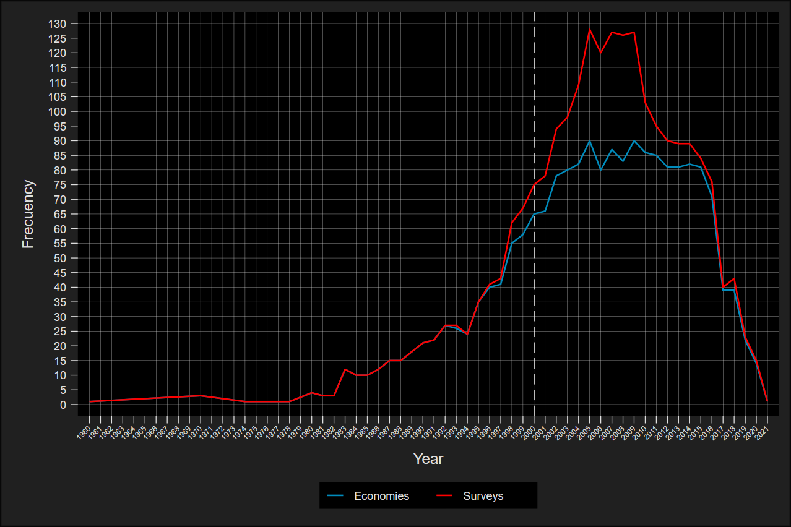{width=60%}

$$\text{Coresidence Rate}=\frac{\text{Son's living with their father}}{\text{Total of Son's + Total of fathers}}$$

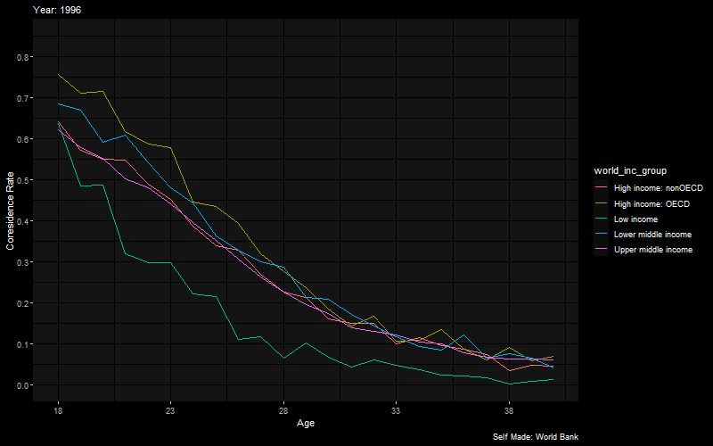{width=70%}

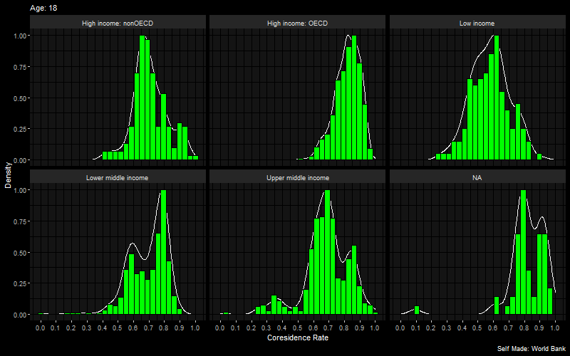{width=70%}

It can be seen that the average coresidency rate has increased at all ages over time. 
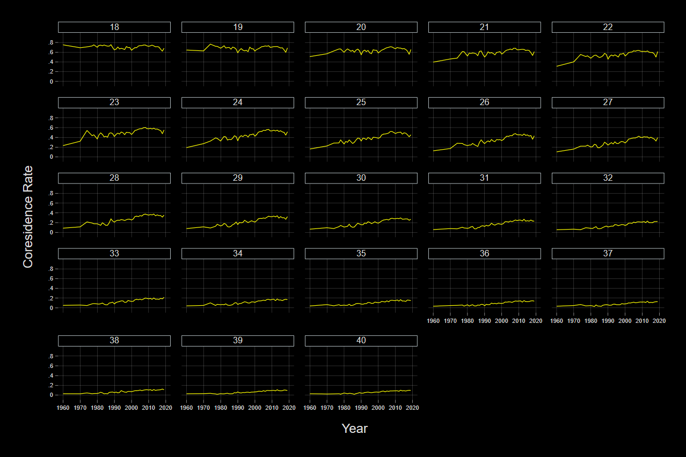{width=70%}

$$\text{Labor Force Participation Rate}=\frac{Employed + Unemployed}{\text{Working age population}}$$

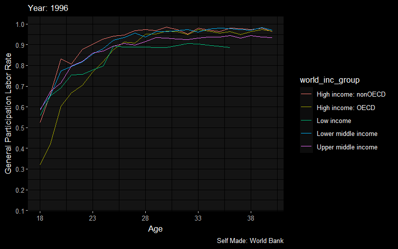{width=70%}

It can be seen that in the younger ages, the labor participation rate has been falling over time. This is presumably due to the greater opportunities that exist in tertiary education. 
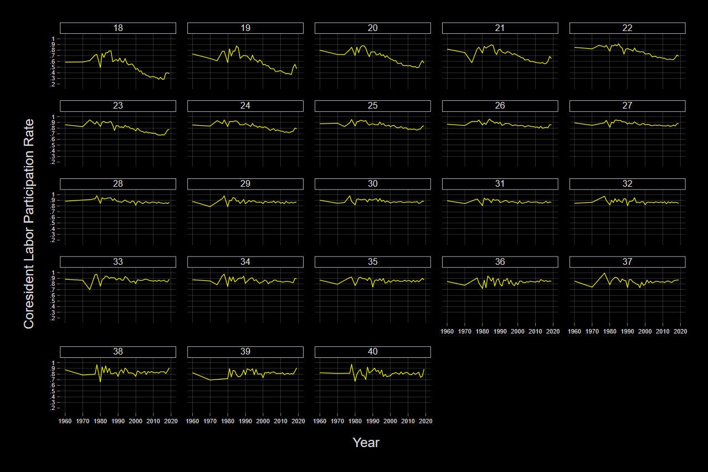{width=70%}

$$\text{Ocupation Rate}=\frac{Employed}{\text{Working age population}}$$

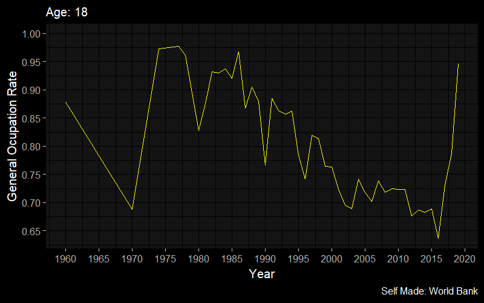{width=70%}

# Social Mobility
$$y_s=\text{ln(Children's income) or Children's Education}$$
$$y_f=\text{ln(Father's income) or  Father's Education}$$
$$X=\text{Control Variables}$$

$$y_s=\alpha+\underbrace{\beta}_{\text{Mobility Coefficient}} y_f+\gamma X+u_i$$
The closer $\beta$ is to 0, the greater the social mobility.

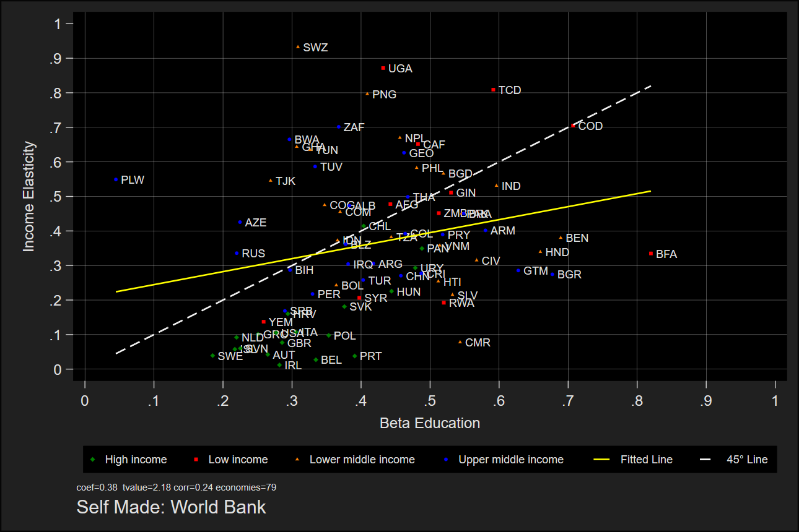{width=60%}

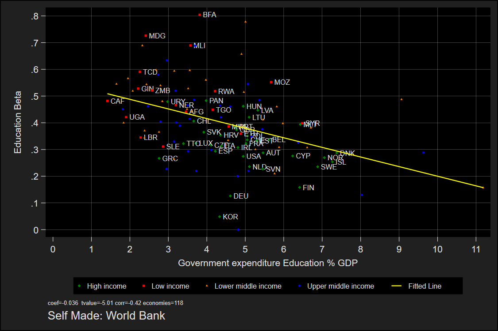{width=60%}

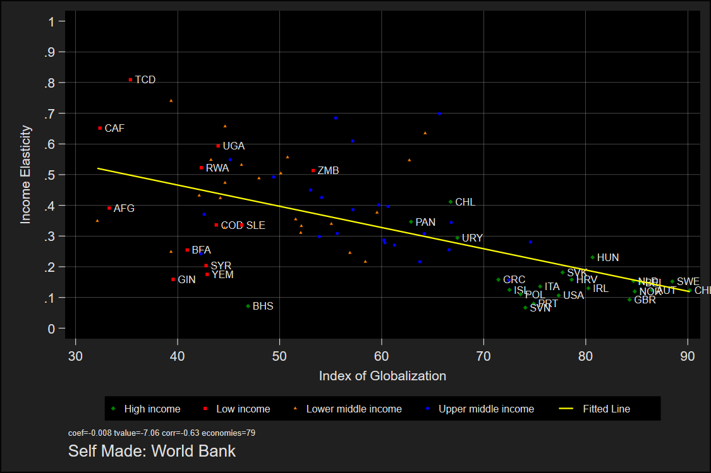{width=60%}

## Great Gatsby Curve Evidence

In line with the existing literature, it can be seen that countries with higher levels of inequality have lower levels of social mobility. 

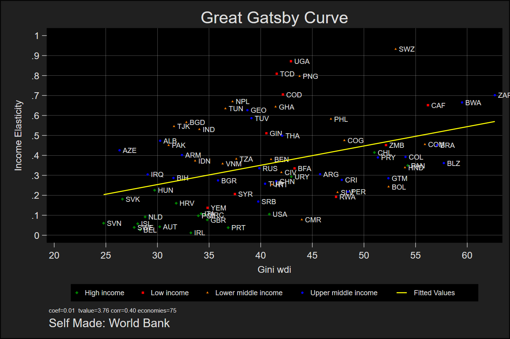{width=60%}

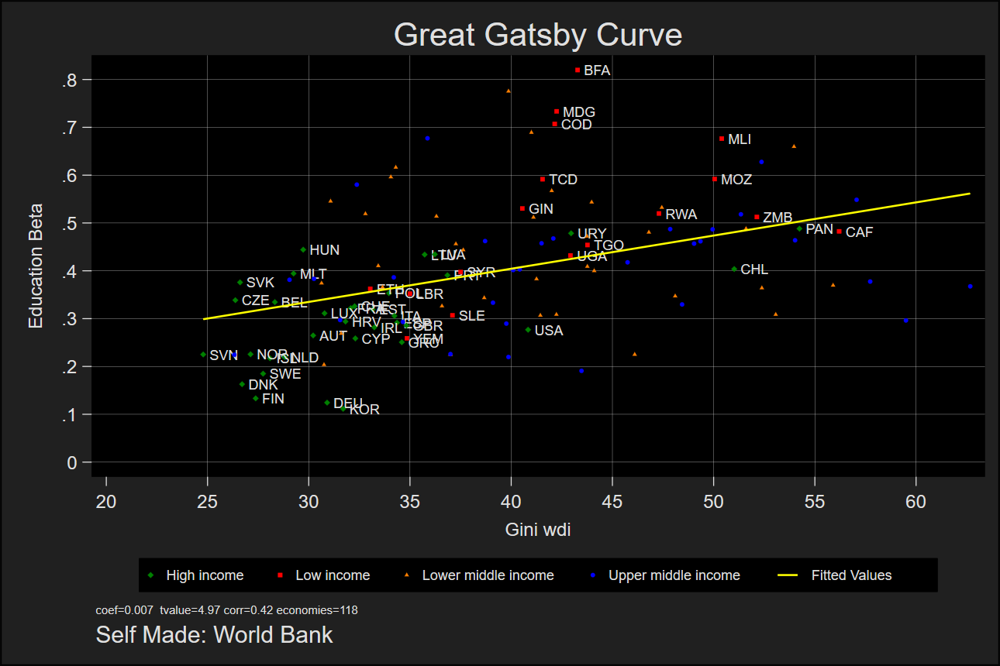{width=60%}

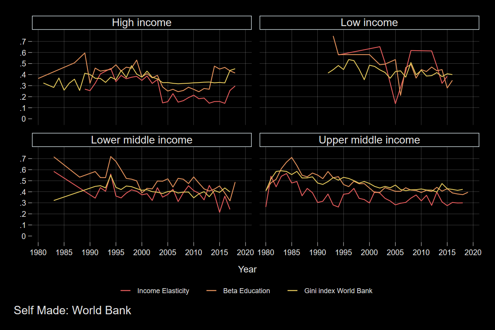{width=60%}

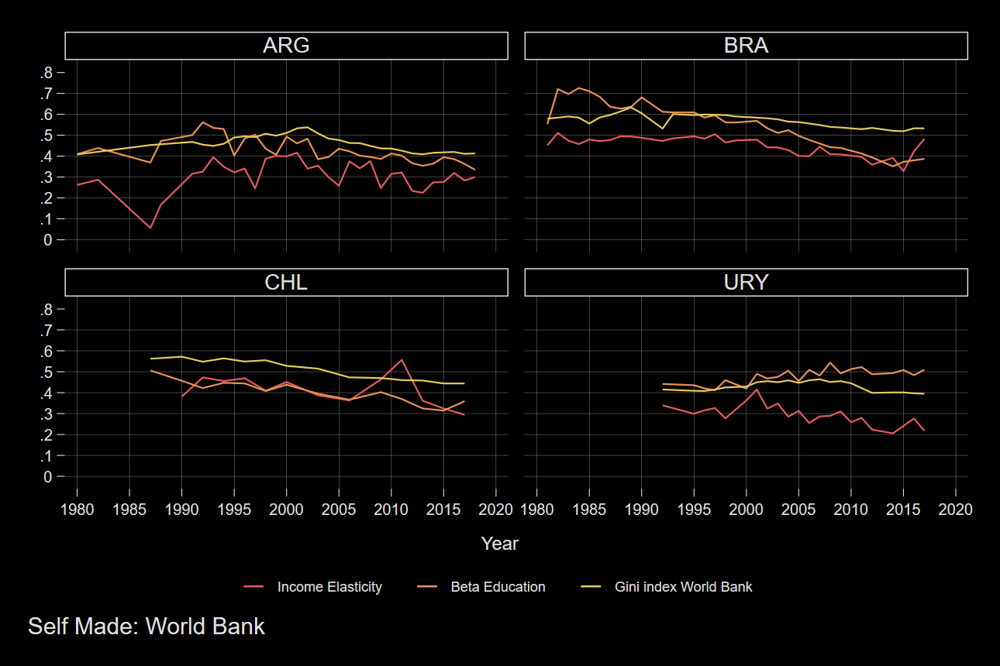{width=60%}

